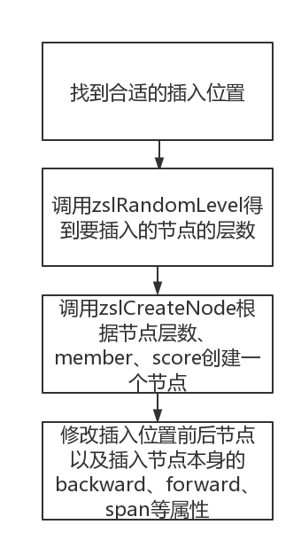

在讲redis的hash数据结构之前我们先了解下skiplist
[Wikipedia](https://en.wikipedia.org/wiki/Skip_list)给出的解释如下：
跳跃列表(skiplist)是一种数据结构。它允许快速查询一个有序连续元素的数据链表。跳跃列表的平均查找和插入时间复杂度都是O(log n)，优于普通队列的O(n)。
通俗的讲就是：跳跃表是一种有序的数据结构，它通过在每个节点中维持多个指向其他节点的指针，从而达到快速访问节点的目的。
skiplist的插入流程如下


<!--more-->

在这里我们就不继续深讨这个算法了。
## Redis中的skiplist
在redis中，skiplist的定义
如下（server.h）：
```c
//注意4.x版本的ZSKIPLIST_MAXLEVEL 还是32
#define ZSKIPLIST_MAXLEVEL 64 /* Should be enough for 2^64 elements */
#define ZSKIPLIST_P 0.25      /* Skiplist P = 1/4 */

/* ZSETs use a specialized version of Skiplists */
typedef struct zskiplistNode {
    // 成员对象
    sds ele;
    //分值
    double score;
    //指向上一个节点,用于zrevrange命令
   // backward变量是特意为zrevrange*系列命令准备的，目的是为了使跳跃表实现反向遍历，普通跳跃表的实现里是非必要的
    struct zskiplistNode *backward;
    struct zskiplistLevel {
        //前进指针，指向下一个节点
        struct zskiplistNode *forward;
        //到达后一个节点的跨度(两个相邻节点span为1)
        unsigned long span;
    } level[];//该节点在各层的信息，柔性数组成员
} zskiplistNode;

typedef struct zskiplist {
    //表头和表尾节点
    struct zskiplistNode *header, *tail;
    // 表中节点的数量
    unsigned long length;
    // 表中层数最大的节点的层数
    int level;
} zskiplist;
```

## 在redis的源码中，作者为了满身redis的要求，对skiplist进行了修改：
- 允许重复的 score 值：多个不同的 member 的 score 值可以相同，当score相同时根据member(代码里的ele)的字典序来排名。
- 进行对比操作时，不仅要检查 score 值，还要检查 member ：当 score 值可以重复时，单靠 score 值无法判断一个元素的身份，所以需要连 member 域都一并检查才行。
- 每个节点都带有一个高度为 1 层的后退指针，用于从表尾方向向表头方向迭代：当执行 ZREVRANGE 或 ZREVRANGEBYSCORE 这类以逆序处理有序集的命令时，就会用到这个属性。


## zskiplist的相关接口(z_set.c)

### 创建一个zskiplist 
时间复杂度O(1)
```c

/* Create a new skiplist. */
zskiplist *zslCreate(void) {
    int j;
    zskiplist *zsl;
    //分配空间
    zsl = zmalloc(sizeof(*zsl));
    //设置默认层数
    zsl->level = 1;
    //设置跳跃表长度
    zsl->length = 0;
    //64level的头结点,分数为0，没有obj的跳跃表头节点
    zsl->header = zslCreateNode(ZSKIPLIST_MAXLEVEL,0,NULL);
    //跳跃表头节点初始化
    for (j = 0; j < ZSKIPLIST_MAXLEVEL; j++) {
        //头结点每个level的下一个节点都初始化为null，跨度为0
        zsl->header->level[j].forward = NULL;
        zsl->header->level[j].span = 0;
    }
    //跳跃表头节点的后退指针backward置为NULL
    zsl->header->backward = NULL;
    //表头指向跳跃表尾节点的指针置为NULL
    zsl->tail = NULL;
    return zsl;
}


/* Create a skiplist node with the specified number of levels.
 * The SDS string 'ele' is referenced by the node after the call. */
//为指定高度的节点分配空间并赋值，insert操作也要用到
zskiplistNode *zslCreateNode(int level, double score, sds ele) {
    /柔性数组成员
    zskiplistNode *zn = zmalloc(sizeof(*zn)+level*sizeof(struct zskiplistLevel));
    zn->score = score;
    zn->ele = ele;zskiplist
    return zn;
}

```

### zskiplist插入一个节点 
时间复杂度O(logn)
插入节点的流程如下：

```c

/* Insert a new node in the skiplist. Assumes the element does not already
 * exist (up to the caller to enforce that). The skiplist takes ownership
 * of the passed SDS string 'ele'. */
//创建一个节点，分数为score，对象为ele，插入到zsl表头管理的跳跃表中，并返回新节点的地址
zskiplistNode *zslInsert(zskiplist *zsl, double score, sds ele) {
    zskiplistNode *update[ZSKIPLIST_MAXLEVEL], *x;
    unsigned int rank[ZSKIPLIST_MAXLEVEL];
    int i, level;

    serverAssert(!isnan(score));
    //获取跳跃表头结点地址，从头节点开始一层一层遍历
    x = zsl->header;
    for (i = zsl->level-1; i >= 0; i--) {
        /* store rank that is crossed to reach the insert position */
        //遍历头节点的每个level，从下标最大层减1一直到0
        rank[i] = i == (zsl->level-1) ? 0 : rank[i+1];
        //这个while循环是查找的过程，沿着x指针遍历跳跃表，满足以下条件则要继续在当层往前走
        while (x->level[i].forward &&
                (x->level[i].forward->score < score ||
                    (x->level[i].forward->score == score &&
                    sdscmp(x->level[i].forward->ele,ele) < 0)))
        {
            //记录该层一共跨越了多少节点 加上 上一层遍历所跨越的节点数
            rank[i] += x->level[i].span;
            //指向下一个节点
            x = x->level[i].forward;
        }
        //while循环跳出时，用update[i]记录第i层所遍历到的最后一个节点，遍历到i=0时，就要在该节点后要插入节点
        update[i] = x;
    }
    /* we assume the element is not already inside, since we allow duplicated
     * scores, reinserting the same element should never happen since the
     * caller of zslInsert() should test in the hash table if the element is
     * already inside or not. */
    //获得一个随机的层数
    level = zslRandomLevel();
    //如果大于当前所有节点最大的层数时
    if (level > zsl->level) {
        for (i = zsl->level; i < level; i++) {
            //将大于等于原来zsl->level层以上的rank[]设置为0
            rank[i] = 0;
            //将大于等于原来zsl->level层以上update[i]指向头结点
            update[i] = zsl->header;
            //update[i]已经指向头结点，将第i层的跨度设置为length，length代表跳跃表的节点数量
            update[i]->level[i].span = zsl->length;
        }
        //更新表中的最大成数值
        zsl->level = level;
    }
    //创建一个节点
    x = zslCreateNode(level,score,ele);
    for (i = 0; i < level; i++) {
        //设置新节点的前进指针为查找时（while循环）每一层最后一个节点的的前进指针
        x->level[i].forward = update[i]->level[i].forward;
        //再把查找时每层的最后一个节点的前进指针设置为新创建的节点地址
        update[i]->level[i].forward = x;

        /* update span covered by update[i] as x is inserted here */
        //更新插入节点的跨度值
        x->level[i].span = update[i]->level[i].span - (rank[0] - rank[i]);
        update[i]->level[i].span = (rank[0] - rank[i]) + 1;
    }

    /* increment span for untouched levels */
    //如果插入节点的level小于原来的zsl->level才会执行
    for (i = level; i < zsl->level; i++) {
        //因为高度没有达到这些层，所以只需将查找时每层最后一个节点的值的跨度加1
        update[i]->level[i].span++;
    }
    //设置插入节点的后退指针，就是查找时最下层的最后一个节点，该节点的地址记录在update[0]中
    //如果插入在第二个节点，也就是头结点后的位置就将后退指针设置为NULL
    x->backward = (update[0] == zsl->header) ? NULL : update[0];
    //x节点不是最尾部的节点
    if (x->level[0].forward)
        //将x节点后面的节点的后退节点设置成为x地址
        x->level[0].forward->backward = x;
    else
        //更新表头的tail指针，指向最尾部的节点x
        zsl->tail = x;
    //跳跃表节点计数器加1
    zsl->length++;
    return x;
}

/* Returns a random level for the new skiplist node we are going to create.
 * The return value of this function is between 1 and ZSKIPLIST_MAXLEVEL
 * (both inclusive), with a powerlaw-alike distribution where higher
 * levels are less likely to be returned. */
//返回一个随机的层数，不是level的索引是层数
int zslRandomLevel(void) {
    int level = 1;
    //有1/4的概率加入到上一层中
    while ((random()&0xFFFF) < (ZSKIPLIST_P * 0xFFFF))
        level += 1;
    return (level<ZSKIPLIST_MAXLEVEL) ? level : ZSKIPLIST_MAXLEVEL;
}
```

### zskiplist删除一个节点 
时间复杂度O(logn)
释放一个节点的内存 时间复杂度O(1)：
```c
void zslFreeNode(zskiplistNode *node) {
    //member的引用计数-1，防止内存泄漏
    sdsfree(node->ele);
    zfree(node);
}

/* Free an sds string. No operation is performed if 's' is NULL. */
void sdsfree(sds s) {
    if (s == NULL) return;
    s_free((char*)s-sdsHdrSize(s[-1]));
}
```

释放整个skiplist的内存 时间复杂度O(n)：
```c
/* Free a whole skiplist. */
void zslFree(zskiplist *zsl)
    //任何一个节点一定有level[0]，所以迭代level[0]来删除所有节点{
    zskiplistNode *node = zsl->header->level[0].forward, *next;

    zfree(zsl->header);
    while(node) {
        next = node->level[0].forward;
        zslFreeNode(node);
        node = next;
    }
    zfree(zsl);
}
```
从skiplist中删除并释放掉一个节点 时间复杂度O(logn)：
主要分为以下3个步骤：

- 根据member(ele)和score找到节点的位置（代码里变量x即为该节点，update记录每层x的上一个节点）
- 调动zslDeleteNode把x节点从skiplist逻辑上删除
- 释放x节点内存。
```c
/* Delete an element with matching score/element from the skiplist.
 * The function returns 1 if the node was found and deleted, otherwise
 * 0 is returned.
 *
 * If 'node' is NULL the deleted node is freed by zslFreeNode(), otherwise
 * it is not freed (but just unlinked) and *node is set to the node pointer,
 * so that it is possible for the caller to reuse the node (including the
 * referenced SDS string at node->ele). */
//从skiplist逻辑上删除一个节点并释放该节点的内存
int zslDelete(zskiplist *zsl, double score, sds ele, zskiplistNode **node) {
    zskiplistNode *update[ZSKIPLIST_MAXLEVEL], *x;
    int i;

    x = zsl->header;
    for (i = zsl->level-1; i >= 0; i--) {
        while (x->level[i].forward &&
                (x->level[i].forward->score < score ||
                    (x->level[i].forward->score == score &&
                     sdscmp(x->level[i].forward->ele,ele) < 0)))
        {
            x = x->level[i].forward;
        }
        update[i] = x;
    }
    /* We may have multiple elements with the same score, what we need
     * is to find the element with both the right score and object. */
    x = x->level[0].forward;
    if (x && score == x->score && sdscmp(x->ele,ele) == 0) {
        zslDeleteNode(zsl, x, update);
        if (!node)
            zslFreeNode(x);
        else
            *node = x;
        return 1;
    }
    return 0; /* not found */
}
/* Internal function used by zslDelete, zslDeleteByScore and zslDeleteByRank */
//从skiplist逻辑上删除一个节点（不释放内存，仅改变节点位置关系）
//x为要删除的节点
//update为每一层x的上一个节点(为了更新x上一个节点的forward和span属性)
void zslDeleteNode(zskiplist *zsl, zskiplistNode *x, zskiplistNode **update) {
    int i;
    for (i = 0; i < zsl->level; i++) {
        if (update[i]->level[i].forward == x) {
            update[i]->level[i].span += x->level[i].span - 1;
            update[i]->level[i].forward = x->level[i].forward;
        } else {
            update[i]->level[i].span -= 1;
        }
    }
    //是否是tail节点
    if (x->level[0].forward) {
        x->level[0].forward->backward = x->backward;
    } else {
        zsl->tail = x->backward;
    }
    //删除了最高层数的节点
    while(zsl->level > 1 && zsl->header->level[zsl->level-1].forward == NULL)
        zsl->level--;
    zsl->length--;
}
```