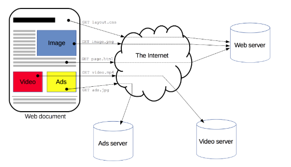

# HTTP概述 
通过网络模型相关的学习，我们了解到HTTP在四层模型中属于应用层。
HTTP是一种能够获取如 HTML 这样的网络资源的 protocol(通讯协议)。它是在 Web 上进行数据交换的基础，是一种 client-server 协议，也就是说，请求通常是由像浏览器这样的接受方发起的。一个完整的Web文档通常是由不同的子文档拼接而成的，像是文本、布局描述、图片、视频、脚本等等。
 
> http1.1是rfc2616，[在这](https://www.ietf.org/rfc/rfc2616.txt)

