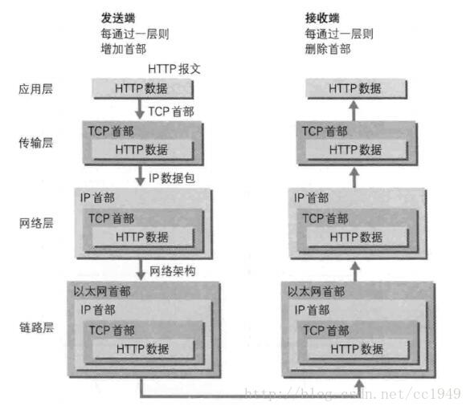

# OSI模型

我们在日常的开发中都离不开网络，常见的有TCP、UDP、HTTP、ICMP等等。但是说到网络模型，我们都知道由以下划分方式：
1. OSI七层模型
2. TCP/IP四层模型
3. 五层模型

## OSI七层模型
> 详细的介绍可以参考官方文档：[传送地址](https://zh.wikipedia.org/wiki/OSI%E6%A8%A1%E5%9E%8B)    

OSI模型是从上往下的，越靠近底层就越接近硬件，反之越往上越接近软件。
分层功能职责可以总结如下

- 物理层：
  底层数据传输，如网线；网卡标准。 
  
- 数据链路层：
  定义数据的基本格式，如何传输，如何标识；如网卡MAC地址。
  
- 网络层：
  定义IP编址，定义路由功能；如不同设备的数据转发。
  
- 传输层：
  端到端传输数据的基本功能；如 TCP、UDP。
  
- 会话层：
  控制应用程序之间会话能力；如不同软件数据分发给不同软件。
  
- 标识层：
  数据格式标识，基本压缩加密功能。
  
- 应用层：
  各种应用软件，包括 Web 应用。
  
  

七层模型的意义?

互联网的实现，分成好几层，每一层都有自己的功能，就像建筑物一样，每一层都靠下一层支持。OSI模型就是这样的一个分层，它是一个由国际标准化组织提出的概念模型,试图提供一个使各种不同的终端和网络类型在世界范围内实现互联的标准框架。划分为七层，每层都可以提供抽象良好的接口。

** 网络七层模型是一个标准，而非实现**

## **五层模型**

五层体系结构包括：应用层、运输层、网络层、数据链路层和物理层。五层协议只是OSI和TCP/IP的综合，是业界产生出来的非官方协议模型，实际应用还是TCP/IP的四层结构，在此不再累述。

**五层模型的意义?**

所谓的五层协议的网络体系结构其实是为了方便学习计算机网络原理而采用的，综合了OSI七层模型和TCP/IP的四层模型而得到的五层模型。

## TCP/IP四层

TCP/IP分层模型被称作因特网分层模型(Internet Layering Model)、因特网参考模型(Internet Reference Model)。TCP/IP和OSI模型组并不能精确的匹配，但是我们可以尽可能的参考OSI模型并在其中找到TCP/IP的对应位置。如下图所示，OSI模型到TCP/IP模型映射关系。通常人们认为OSI模型最上面三层(应用层、表示层、会话层)在TCP/IP中是一个应用层。由于TCP/IP有一个相对比较弱的会话层，由TCP和RTP下的打开和关闭连接组成，并在TCP/UDP下的各种应用提供不同的端口号，这些功能被单个的应用程序添加。

TCP/IP 协议中每层技术举例：

网络访问层：ARP、RARP

互联网层：ICMP、IP

传输层：TCP、UDP

应用层：DNS、FTP、HTTP、SMTP、TELNET、IRC、WHOIS

在四层，既传输层数据被称作段(Segments);三层网络层数据被称做包(Packages);二层数据链路层时数据被称为帧(Frames);一层物理层时数据被称为比特流(Bits)。其中传输层和网络层被完整保留，因此网络中最核心的技术就是传输层和网络层技术。

从上往下，每经过一层，协议就会在包头上面做点手脚，加点东西，传送到接收端，再层层解套出来，如下示意图：

 

网络四层模型是一个实现的应用模型。

网络四层模型由七层模型简化合并而来。

TCP/IP四层模型跟OSI模型有什么不一样?

OSI是一个完整的、完善的宏观理论模型;而TCP/IP(参考)模型，更加侧重的是互联网通信核心(也是就是围绕TCP/IP协议展开的一系列通信协议)的分层，因此它不包括物理层，以及其他一些不想干的协议;其次，之所以说他是参考模型，是因为他本身也是OSI模型中的一部分，因此参考OSI模型对其分层。

