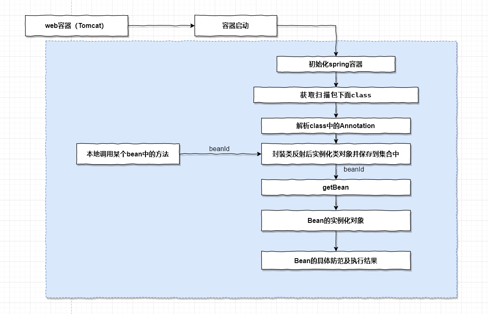

# 什么是 IoC 容器
IoC 全称为 `Inversion of Control`，翻译为 “控制反转”，它还有一个别名为 DI（Dependency Injection）,即依赖注入。IOC容器负责实例化、定位、配置应用程序中的对象及建立这些对象间的依赖。交由Spring容器统一进行管理，从而实现松耦合。
> 谁控制谁? 控制什么? 为何是反转（有反转就应该有正转了）? 哪些方面反转了?

**谁控制谁?**
在传统的开发模式下，我们都是采用直接 new 一个对象的方式来创建对象，也就是说你依赖的对象直接由你自己控制，但是有了 IOC 容器后，则直接由 IoC 容器来控制。所以“谁控制谁”，当然是 IoC 容器控制对象。

**控制什么?**
控制对象。

**为何是反转?**
传统应用程序是由我们自己在对象中主动控制去直接获取依赖对象，也就是正转；而反转则是由容器来帮忙创建及注入依赖对象；为何是反转？因为由容器帮我们查找及注入依赖对象，对象只是被动的接受依赖对象，所以是反转。

**哪些方面反转了?**
所依赖对象的获取被反转了。

IOC Service Provider 为被注入对象提供被依赖对象也有如下几种方式：构造方法注入、stter方法注入、接口注入。

## IOC实现原理
使用反射机制+XML流程如下

从上图可以看出，当web容器启动的时候，spring的全局bean管理器会去相关的xml中扫描包下面的所有class，根据相关的注解对其进行封装，把封装好的数据放进全局bean容器中进行管理。容器初始化完成之后，beanId与bean的实例化类对象就存在相关的集合中了。
我们在某个service里面调用另一个bean的方法时，我们只需要依赖注入另一个bean对象的id，spring会初始化完成的bean容器中获取即可，如果存在就把依赖的bean的类的实例化对象返回给你，你就可以调用依赖的bean的相关方法或属性等。

