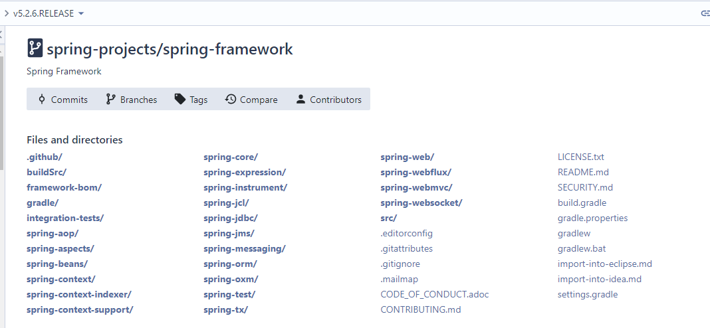

# 源码下载及说明
本系列文章是基于spring-framework@v5.2.6.RELEASE版本。

## 1. 下载源码
spring-framework的源码地址如下:
https://github.com/spring-projects/spring-framework

## 2. 项目结构及说明

### 2.1 项目结构
Spring Framework 由组成大约 20 个模块的 features 组成。这些模块分为 Core Container，Data Access/Integration， Web，AOP(Aspect Oriented Programming)，Instrumentation，Messaging 和 Test，如下图所示。

图片来自[这里](https://docs.spring.io/spring/docs/5.2.6.RELEASE/spring-framework-reference/index.html)

## 2.2 模块说明
### 2.2.1 核心容器
核心容器由`spring-core`，`spring-beans`，`spring-context`，`spring-context-support`和`spring-expression`(Spring 表达式语言)模块组成。

`spring-core`和`spring-beans`模块提供 framework 的基本部分，包括 IoC 和依赖注入 features。 BeanFactory是工厂 pattern 的复杂 implementation。它消除了对程序化单例的需求，并允许您从实际程序逻辑中分离 configuration 和依赖项规范。

Context(`spring-context`)模块构建在核心和 Beans模块提供的坚实基础之上：它是一种以 framework-style 方式访问 objects 的方法，类似于 JNDI 注册表。 Context 模块从 Beans 模块继承其 features 并添加对国际化(使用，例如，资源包)，event 传播，资源加载以及透明的上下文创建的支持，例如，Servlet 容器。 Context 模块还支持 Java EE features，例如 EJB，JMX 和基本远程处理。 ApplicationContext接口是 Context 模块的焦点。 spring-context-support支持将 common third-party libraries 集成到 Spring application context 中，用于缓存(EhCache，Guava，JCache)，邮件(JavaMail)，调度(CommonJ，Quartz)和模板引擎(FreeMarker，JasperReports，Velocity)。

`spring-expression`模块提供了一个强大的表达语言，用于在运行时查询和操作 object 图。它是 JSP 2.1 规范中指定的统一表达式语言(统一 EL)的扩展。该语言支持设置和获取 property 值，property 赋值，方法调用，访问数组，集合和索引器的内容，逻辑和算术操作符，命名变量以及 Spring 的 IoC 容器中的 name 检索 objects。它还支持列表投影和选择以及 common 列表聚合。

### 2.2.2 AOP 和仪表
spring-aop模块提供AOP Alliance-compliant aspect-oriented 编程 implementation，允许您为 example 定义方法拦截器和切入点，以干净地解耦实现应该分离的功能的 code。使用 source-level 元数据功能，您还可以以类似于.NET 属性的方式将行为信息合并到 code 中。

单独的spring-aspects模块提供与 AspectJ 的 integration。

spring-instrument模块提供 class 检测支持和类加载器 implementations 以在某些 application 服务器中使用。 spring-instrument-tomcat模块包含 Spring 的 Tomcat 检测代理。

### 2.2.3 消息
Spring Framework 4 包含一个spring-messaging模块，其中包含来自 Spring Integration 项目的 key 抽象，例如Message，MessageChannel，MessageHandler等，以作为 messaging-based applications 的基础。该模块还包括一组 annotations，用于将消息映射到方法，类似于基于 Spring MVC annotation 的编程 model。

### 2.2.4 数据 Access/Integration
Data Access/Integration 层由 JDBC，ORM，OXM，JMS 和 Transaction 模块组成。

spring-jdbc模块提供JDBC -abstraction 层，无需进行繁琐的 JDBC 编码和解析 database-vendor 特定错误代码。

spring-tx模块支持程序性和声明式 transaction management 用于实现特殊接口的 classes 和所有 POJO(Plain Old Java Objects)。

spring-orm模块为流行的object-relational 映射 API 提供 integration 层，包括JPA，JDO和Hibernate。使用spring-orm模块，您可以将所有这些 O/R-mapping 框架与 Spring 提供的所有其他 features 结合使用，例如前面提到的简单声明 transaction management feature。

spring-oxm模块提供了一个支持Object/XML 映射 __mplementation 的抽象层，例如 JAXB，Castor，XMLBeans，JiBX 和 XStream。

spring-jms模块(Java 消息传递服务)包含用于 producing 和 consuming 消息的 features。从 Spring Framework 4.1 开始，它为spring-messaging模块提供了 integration。

### 2.2.5 Web
Web 层由spring-web，spring-webmvc，spring-websocket和spring-webmvc-portlet模块组成。

spring-web模块提供基本的 web-oriented integration features，例如 multipart 文件上载功能和使用 Servlet listeners 和 web-oriented application context 初始化 IoC 容器。它还包含 HTTP client 和 Spring 远程支持的 web-related 部分。

spring-webmvc模块(也称为 Web-Servlet 模块)包含 Spring 的 model-view-controller(MVC)和 REST Web Services implementation for web applications。 Spring 的 MVC framework 提供了域 model code 和 web 表单之间的清晰分离，并与 Spring Framework 的所有其他 features 集成。

spring-webmvc-portlet模块(也称为 Web-Portlet 模块)提供了在 Portlet 环境中使用的 MVC implementation，并且 mirrors Servlet-based spring-webmvc模块的功能。

###  2.2.6 测试
spring-test模块使用 JUnit 或 TestNG 支持单元测试和整合测试 Spring 组件。它提供了loading的 Spring ApplicationContext和高速缓存这些上下文。它还提供mock objects，您可以使用它来隔离测试您的 code。

