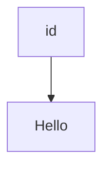
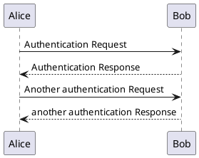

``` mermaid! 
graph TB 
    id --> Hello
``` 


 
```mindmap
root
  topic1
    subtopic
  topic2
    subtopic
```

``` mindmap!
分支一
  分支一a
  分支一b
分支二
  分支二a
  分支二b
```


### plantuml  


```plantuml
@startuml
Alice -> Bob: Authentication Request
Bob --> Alice: Authentication Response
 
Alice -> Bob: Another authentication Request
Alice <-- Bob: another authentication Response
@enduml
```

```tex
    E=mc^2
```